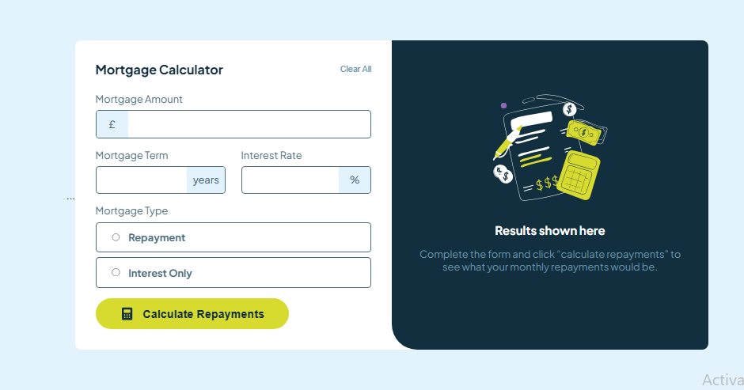

# Frontend Mentor - Mortgage repayment calculator solution

This is a solution to the [Mortgage repayment calculator challenge on Frontend Mentor](https://www.frontendmentor.io/challenges/mortgage-repayment-calculator-Galx1LXK73). Frontend Mentor challenges help you improve your coding skills by building realistic projects.

## Table of contents

- [Overview](#overview)
  - [The challenge](#the-challenge)
  - [Screenshot](#screenshot)
  - [Links](#links)
- [My process](#my-process)
  - [Built with](#built-with)
  - [What I learned](#what-i-learned)
  - [Continued development](#continued-development)
  - [Useful resources](#useful-resources)
- [Author](#author)

---

## Overview

### The challenge

Users should be able to:

- Input mortgage information and see monthly repayment and total repayment amounts after submitting the form
- See form validation messages if any field is incomplete
- Complete the form only using their keyboard
- View the optimal layout for the interface depending on their device's screen size
- See hover and focus states for all interactive elements on the page

### Screenshot



### Links

- Solution URL: [Solution Here || Github](https://github.com/Yaseeru/mortgage-repayment-calculator)
- Live Site URL: [live URL || Netilfy](https://mortgage-repayment-calculator-solutio.netlify.app/)

---

## My process

### Built with

- Semantic HTML5 markup
- CSS custom properties
- Flexbox
- CSS Grid
- JavaScript (Vanilla)
- Mobile-first workflow
- Accessibility enhancements (ARIA, keyboard support)

### What I learned

Through this challenge, I reinforced the importance of accessibility and progressive enhancement. I learned how to:

- Make forms fully keyboard-navigable
- Use `aria-label`, `aria-hidden`, and `aria-describedby` to improve screen reader usability
- Enhance keyboard focus styles to improve usability
- Build responsive layouts using CSS Grid and Flexbox

Example:

```html
<input
  type="number"
  id="mortgage-amount"
  aria-describedby="mortgage-amount-desc"
/>
```

```css
input:focus {
  outline: 2px solid hsl(245, 100%, 60%);
  outline-offset: 3px;
}
```

```js
form.addEventListener("submit", (e) => {
  e.preventDefault();
  calculateRepayments();
});
```

### Continued development

I want to continue improving accessibility by integrating:

- Full screen reader testing (using NVDA or VoiceOver)
- Error message announcements with `aria-live`
- Better focus indicators for keyboard users

Additionally, I'd like to experiment with storing form state and calculated results in localStorage or sessionStorage.

### Useful resources

- [MDN Web Docs on ARIA roles](https://developer.mozilla.org/en-US/docs/Web/Accessibility/ARIA/Roles) – Helped me understand the use of `role`, `aria-label`, and `aria-live`.
- [A11Y Project](https://www.a11yproject.com/) – A great resource to learn about web accessibility practices.
- [Frontend Mentor Discord](https://discord.gg/frontendmentor) – Got some feedback and shared progress with other developers.

---

## Author

- Website – [Abdulhamid Abdullahi Sulaiman](https://github.com/Yaseeru)
- Frontend Mentor – [@Yaseeru](https://www.frontendmentor.io/profile/Yaseeru)
